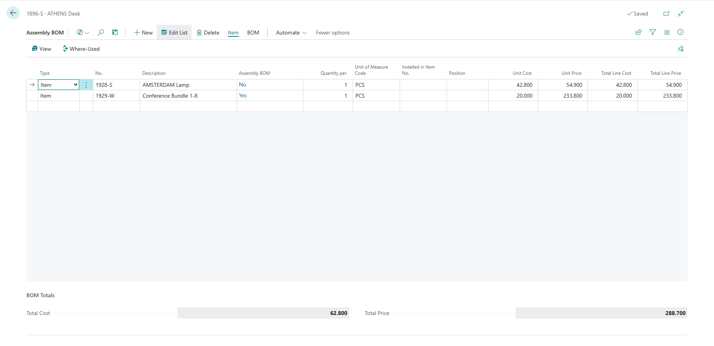
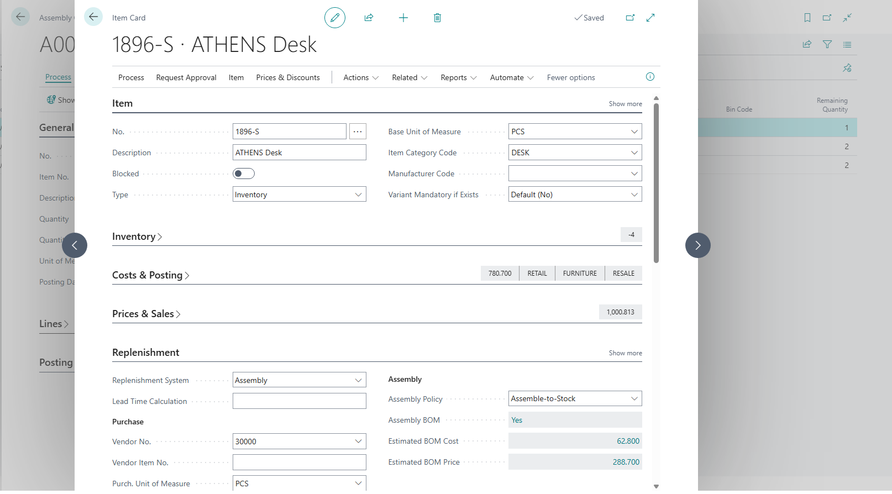

# Assembly BOM Cost & Price Estimator

**Microsoft Dynamics 365 Business Central Extension**

A custom enhancement I developed to add real-time cost and price visibility in Assembly BOMs with proper Unit of Measure conversion.

---

## 📋 Project Overview

This extension solves a common gap in standard Business Central — users could not easily view the **estimated cost and selling price** of an assembled item directly from the BOM and Item Card, especially when using alternate units of measure.

### Business Value
- Helps production/planning teams quickly estimate assembly costs
- Improves pricing decisions for assembled items
- Real-time updates with no manual recalculations

---

## ✨ Features Delivered

- ✅ Real-time calculation of Unit Cost, Unit Price, Line Cost & Line Price
- ✅ Accurate UOM conversion logic (Base UOM → BOM UOM)
- ✅ Live Total Cost & Total Price at BOM level
- ✅ Smart BOM Estimates section on Item Card (visible only for Assembly items)
- ✅ Clean and professional UI integration

---

## 🛠 Technical Implementation

### Objects Developed

| Type             | Name                          | ID       | Key Contribution |
|------------------|-------------------------------|----------|------------------|
| Table Extension  | BOM Component Ext             | 70808802 | `CalculateLineAmounts()` procedure + fields |
| Table Extension  | Item Ext                      | 70808803 | FlowFields for BOM rollups |
| Page Extension   | Assembly BOM Ext              | 70808800 | Real-time fields + Totals group |
| Page Extension   | Item Card Ext                 | 70808801 | Conditional visibility logic |

### Key Technical Highlights

- Proper **UOM Conversion** using `Item Unit of Measure`
- Calculation logic centralized in Table Extension (best practice)
- Efficient FlowFields for BOM totals
- Smart page refresh & visibility handling
- `OnAfterValidate` + `OnAfterGetRecord` triggers for real-time UX

---

## 📸 Screenshots

**1. Enhanced Assembly BOM Page**  

**2. Item Card - BOM Estimates**  

**3. Live BOM Totals**  

---

## 🚀 My Role

- Requirement analysis & solution design
- Full development (AL Language)
- Testing with different UOM scenarios
- UI/UX optimization

---

## 💡 Learning & Best Practices Applied

- Separation of concerns (logic in Table Extension)
- Performance-aware design with FlowFields
- Clean coding standards and proper triggers usage
- Real-world business process understanding (Assembly BOM costing)

---

## 📄 Technologies

- **AL Language**
- Dynamics 365 Business Central
- Visual Studio Code

---

**This project demonstrates my ability to deliver practical, user-focused enhancements in Business Central.**

---

**Alishba**  
Dynamics 365 Business Central Developer  
Lahore, Pakistan
